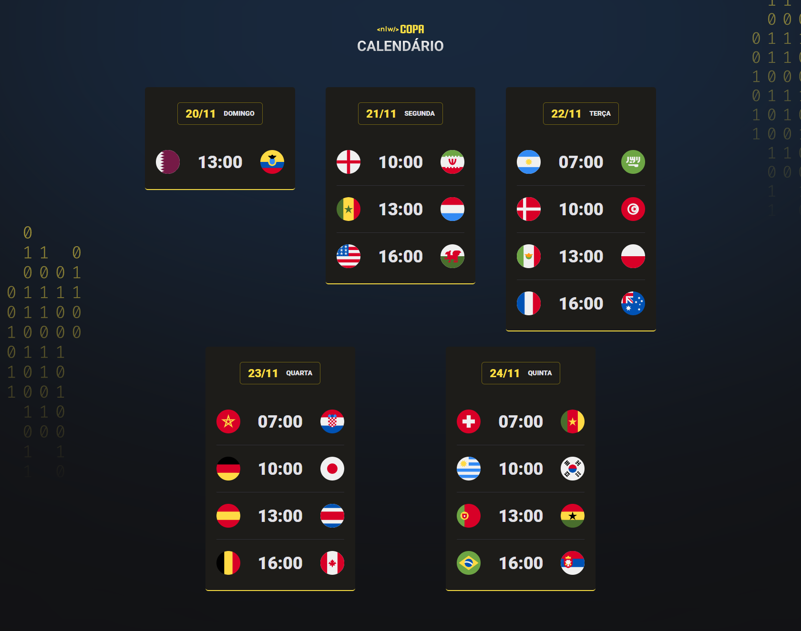

<h1 align="center"> Calendario Copa do Mundo 2022</h1>

Evento NLW promovido pela Rocketseat para ensino de tecnologia WEB.

 

  

## 🚀 Tecnologias

Esse projeto foi desenvolvido com as seguintes tecnologias:

- <strong>
     
      HTML
  </strong>
- <strong>
     
      CSS
  </strong>
- <strong>
      
      Javascript
  </strong>

## 💻 Projeto

O calendário para os jogos da copa do mundo, durante o evento foi ensinado a base para criar os cards com a Data, Seleções e Horarios de forma dinâmica com Javascript.

Pretendo adicionar no futuro as fases de jogos da copa de oitavas, quartas, semi-final e final para treinar todo o conteudo abordado no evento NLW.

## 🌐 Link 

<a href="https://rodrigoaraujoferreira.github.io/calendario-da-copa" target="_blank">Clique aqui para acessar a versão atual do projeto.</a>
